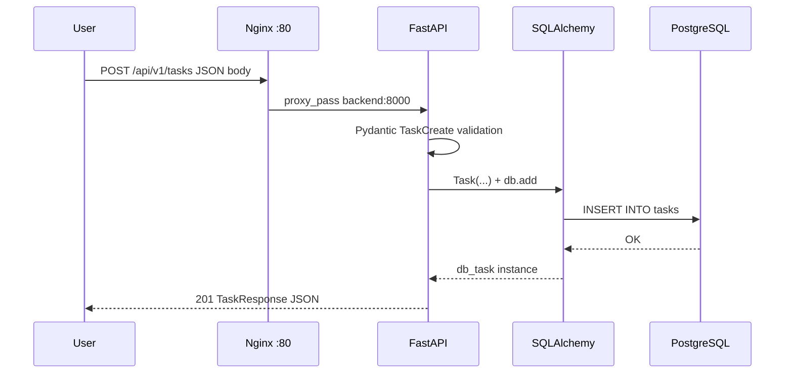
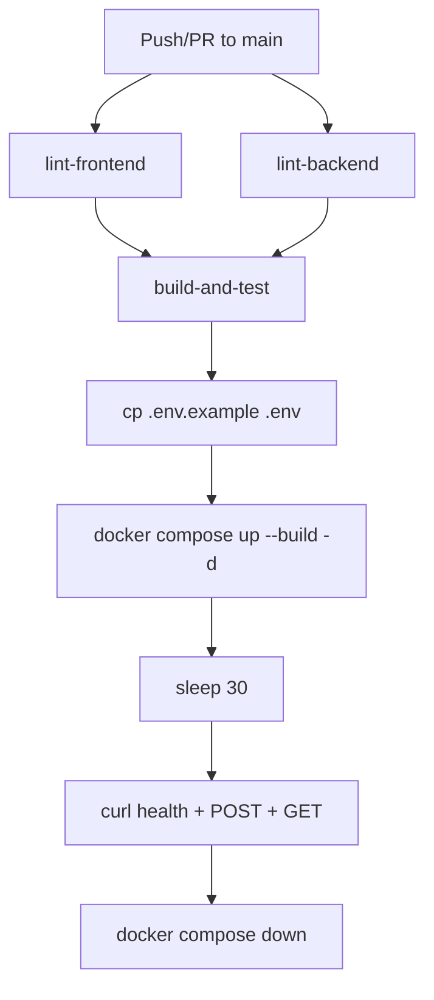
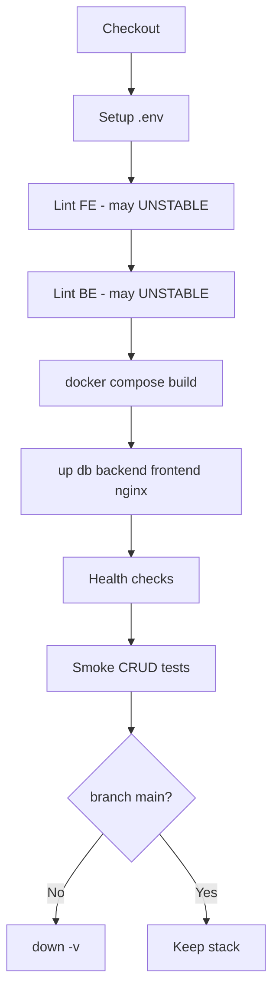

# PROCESS.md — Development Process & Internal Working

> Step-by-step documentation of how the **Containerized Task Management System (TaskFlow)** was conceived, built, integrated, tested, and deployed. Written so a beginner can understand and recreate the project.

---

## Table of Contents

1. [Complete Development Process](#complete-development-process)
2. [Step-by-Step Project Creation Journey](#step-by-step-project-creation-journey)
3. [Internal Working](#internal-working)
4. [Recreate the Project Checklist](#recreate-the-project-checklist)

---

## Complete Development Process

### Phase 1 — Requirement Gathering

**Goals identified:**

- Users must create, view, update, and delete tasks.
- Each task has: title (required), description (optional), status (`pending` | `completed`).
- UI must be responsive and intuitive.
- System must run entirely via Docker Compose (no manual server installs on deploy targets).
- Automated pipelines must validate code quality and basic API behavior.

**Non-goals (initial scope):**

- User login / multi-tenant accounts
- Kubernetes orchestration
- Mobile native apps

### Phase 2 — Planning Phase

| Decision | Choice | Rationale |
|----------|--------|-----------|
| API style | REST, versioned `/api/v1` | Simple, interview-friendly, works well with curl/CI |
| DB access | Async SQLAlchemy + asyncpg | Matches FastAPI async model; scalable I/O |
| Frontend | React + Vite | Fast dev experience, industry standard |
| Styling | Tailwind CSS | Rapid UI without heavy custom CSS |
| Deployment unit | Docker Compose | Single-command startup for evaluators |
| CI | GitHub Actions + Jenkins | Cloud CI + self-hosted DevOps demo |

### Phase 3 — Architecture Design

**Service boundaries:**

1. **PostgreSQL** — data only
2. **Backend** — API + ORM
3. **Frontend** — static SPA (internal Nginx)
4. **Nginx (edge)** — single entry point on port 80
5. **Jenkins** — automation (optional fifth service)

**Network principle:** Only the edge Nginx and Jenkins UI expose host ports. Backend talks to `db` hostname on the default Compose network.

### Phase 4 — Development Steps

#### Backend (FastAPI)

1. Created `Settings` in `app/core/config.py` for `DATABASE_URL` and `CORS_ORIGINS`.
2. Configured async engine and `get_db()` dependency in `app/db/session.py`.
3. Defined `Task` model with UUID primary key in `app/models/task.py`.
4. Added Pydantic schemas with validators (non-whitespace title) in `app/schemas/task.py`.
5. Implemented routes in `app/api/v1/tasks.py`:
   - Health, list, create, update, delete
6. Wired lifespan in `main.py` to auto-create tables on startup.
7. Added `Dockerfile` (Python 3.11-slim + Uvicorn).

#### Frontend (React)

1. Scaffolded Vite + React 18 project.
2. Centralized API client in `App.jsx` using Axios and `VITE_API_BASE_URL`.
3. Built components:
   - `Navbar` — statistics
   - `TaskForm` — creation with validation
   - `TaskList` / `TaskCard` — display, inline edit, delete confirm
   - `FilterButtons` — all / pending / completed
4. Multi-stage `Dockerfile`: Node build → Nginx serve with SPA `try_files`.

#### Infrastructure

1. `docker-compose.yml` — 4 core services + Jenkins.
2. `nginx/nginx.conf` — path-based routing.
3. `.env.example` — documented variables (committed); `.env` gitignored.

### Phase 5 — Integration Steps

1. Verified backend connects to hostname `db` inside Compose network.
2. Set `VITE_API_BASE_URL=http://localhost/api/v1` so browser calls go through edge proxy.
3. Configured CORS to `*` for development simplicity.
4. Added healthchecks so Nginx starts only after backend is healthy.
5. Mounted Jenkins Docker socket for pipeline `docker compose` commands.

### Phase 6 — Testing Process

| Layer | Tool | What is verified |
|-------|------|------------------|
| Frontend lint | ESLint | JSX/React code quality |
| Backend lint | Flake8 | PEP 8 style (max line 120) |
| Integration | curl | Health, POST 201, GET 200 |
| Jenkins smoke | curl + bash | Full CRUD lifecycle |
| Manual | Browser | UI flows, filters, edit/delete |

### Phase 7 — Deployment Process

**Local / demo deployment:**

```bash
cp .env.example .env
docker compose up --build -d
```

**CI deployment validation (not production cloud):**

- GitHub Actions builds and runs stack on `ubuntu-latest`.
- Jenkins builds with project name `taskmanager`, runs health + smoke tests, tears down on feature branches.

---

## Step-by-Step Project Creation Journey

### Why Each Technology Was Chosen

| Technology | Why |
|------------|-----|
| **FastAPI** | Automatic OpenAPI docs, Pydantic validation, async support |
| **PostgreSQL** | Reliable relational store, UUID support, production credibility |
| **React** | Component model fits task UI; large ecosystem |
| **Vite** | Faster builds than CRA; simple env variable injection |
| **Nginx** | Industry-standard reverse proxy; path routing |
| **Docker** | Environment parity between dev, CI, and demo |
| **Jenkins** | Demonstrates self-hosted CI/CD and declarative pipelines |

### How Each Module Was Developed

#### Database Module

- Single table `tasks` designed for CRUD demos.
- UUIDs avoid sequential ID enumeration in public APIs.
- Timestamps support “newest first” listing (`order_by created_at desc`).

#### API Module

- Thin controllers: validation in Pydantic, persistence in SQLAlchemy.
- 404 on missing UUID for update/delete.
- 204 No Content on successful delete (REST convention).

#### UI Module

- State lifted to `App.jsx` (single source of truth for `tasks[]`).
- Optimistic UX: refresh list after every mutation.
- Client-side filter avoids extra API endpoints.

### Challenges Faced & Solutions

| Challenge | Solution |
|-----------|----------|
| Browser cannot resolve Docker hostname `backend` | Route API through edge Nginx on `localhost`; set `VITE_API_BASE_URL` accordingly |
| CORS errors during dev | `CORSMiddleware` with configurable `CORS_ORIGINS` |
| Frontend routes 404 on refresh | `try_files $uri /index.html` in frontend Nginx |
| Jenkins needs Docker during pipeline | Mount `/var/run/docker.sock`; add `jenkins` user to `docker` group |
| `docker-compose-plugin` missing in Debian image | Install `docker.io`; use host Docker Compose via socket (documented in ops) |
| Port 80 conflict when CI runs while stack is up | Jenkins uses `-p taskmanager` project name; document stopping conflicting stacks |
| Lint should warn but not block demo | Jenkins `catchError(buildResult: 'UNSTABLE')` on lint stages |

### Important Design Decisions

1. **Auto-create tables** instead of Alembic — simpler for academic scope; trade-off is no migration history.
2. **No authentication** — reduces scope; must be stated clearly in viva.
3. **Edge proxy pattern** — one public port mimics production ingress.
4. **Separate CI systems** — GitHub Actions for cloud; Jenkins for self-hosted DevOps narrative.
5. **`.dockerignore`** excludes `Jenkinsfile` and `jenkins/` from app images — smaller, faster builds.

---

## Internal Working

### Request Flow (User Creates a Task)



### Response Flow (List Tasks)

1. `GET /api/v1/tasks` hits `list_tasks()`.
2. `select(Task).order_by(Task.created_at.desc())` executed asynchronously.
3. SQLAlchemy returns model instances.
4. FastAPI serializes to `List[TaskResponse]` JSON.

### Data Storage Flow

```
JSON Request → Pydantic Schema → SQLAlchemy Model → PostgreSQL Row
PostgreSQL Row → SQLAlchemy Model → Pydantic Response → JSON Response
```

**Persistence:** Docker volume `postgres_data` → `/var/lib/postgresql/data` inside DB container. Survives `docker compose down` unless `-v` is used.

### Service Communication

| From | To | Mechanism |
|------|-----|-----------|
| Browser | Edge Nginx | HTTP port 80 |
| Edge Nginx | Frontend container | `proxy_pass http://frontend:80` |
| Edge Nginx | Backend container | `proxy_pass http://backend:8000` |
| Backend | Database | `postgresql+asyncpg://...@db:5432/taskdb` |
| Jenkins | Host Docker | Unix socket `/var/run/docker.sock` |

### CI/CD Workflow

#### GitHub Actions



#### Jenkins Pipeline



**Post actions:**

- `always` — prune dangling images
- `failure` — `docker compose down` for project `taskmanager`
- `cleanup` — `cleanWs()`

### Monitoring and Logging Process

**Current state (built-in):**

| Source | How to access |
|--------|----------------|
| Container logs | `docker compose logs [service]` |
| Nginx access/error | `docker compose logs nginx` |
| FastAPI / Uvicorn | `docker compose logs backend` |
| Jenkins build log | Jenkins UI → job → console output |
| Health endpoints | `GET /api/v1/health`, Compose healthchecks |

**Not implemented:** Prometheus, Grafana, centralized log aggregation, APM.

**Recommended checks during viva demo:**

```bash
docker compose ps
docker compose logs backend --tail 50
curl -s http://localhost/api/v1/health | jq .
```

---

## Recreate the Project Checklist

Use this ordered checklist to rebuild from scratch:

- [ ] 1. Create monorepo folders: `backend/`, `frontend/`, `nginx/`, `jenkins/`
- [ ] 2. Implement FastAPI app (models, schemas, routes, config, session)
- [ ] 3. Implement React UI (App + components + Tailwind)
- [ ] 4. Write Dockerfiles for backend, frontend (multi-stage), nginx
- [ ] 5. Create `docker-compose.yml` with db, backend, frontend, nginx
- [ ] 6. Add `.env.example` and `.gitignore` (ignore `.env`)
- [ ] 7. Test manually: `docker compose up --build`
- [ ] 8. Add `.github/workflows/ci.yml`
- [ ] 9. Add `Jenkinsfile` + Jenkins Docker image + fifth compose service
- [ ] 10. Update `.dockerignore` files
- [ ] 11. Document in README, PROCESS, VIVA, COMMANDS_REFERENCE

---

*For command details, see [COMMANDS_REFERENCE.md](COMMANDS_REFERENCE.md). For interview prep, see [VIVA_QUESTIONS.md](VIVA_QUESTIONS.md).*
